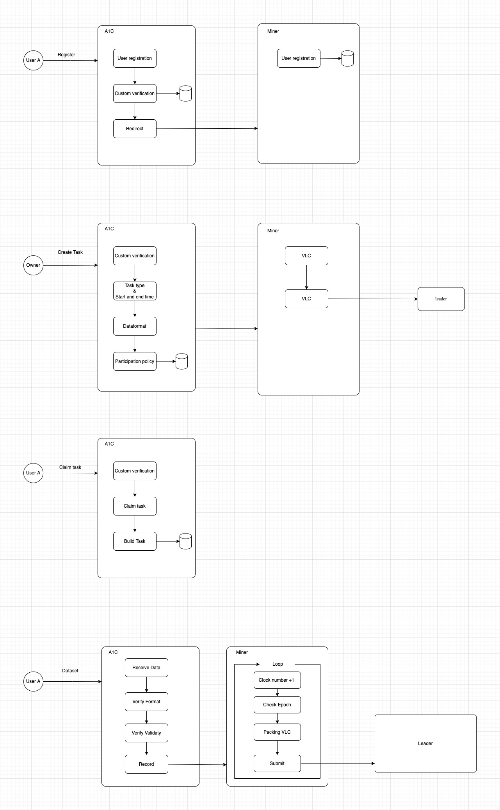

# V1 Miner

## Overview

The miner component is a key part of the Intelligence KEY Mining system, responsible for managing VLC (Verifiable Ledger Computation) operations and coordinating with various validators.

## Architecture Components

### Owner
- **Custom Data Format**: The owner needs to define custom data formats and validate these formats in both A1C and Auxiliary verifiers.

### A1C (Auxiliary 1st Class)
- **Deployment Options**: A1C can be deployed as a separate service, but it's recommended to integrate it directly into the Miner for better performance and reduced latency.

### Miner
- **Core Service**: The Miner is an independent service primarily responsible for operating and maintaining VLC (Verifiable Ledger Computation).

### Leader Validator
- **Configuration Management**: The Leader-validator contains pre-configured information for Consensus-validator nodes, which can also be dynamically obtained later.
- **Business Logic Agnostic**: The Leader-validator doesn't concern itself with specific business logic implementation.

### Consensus Validator
- **Multi-Verifier Support**: Consensus-validator can be associated with multiple Auxiliary verifiers to validate different tasks.
- **Custom Validation Standards**: Validation standards are provided by the project owners themselves.

## System Diagram

