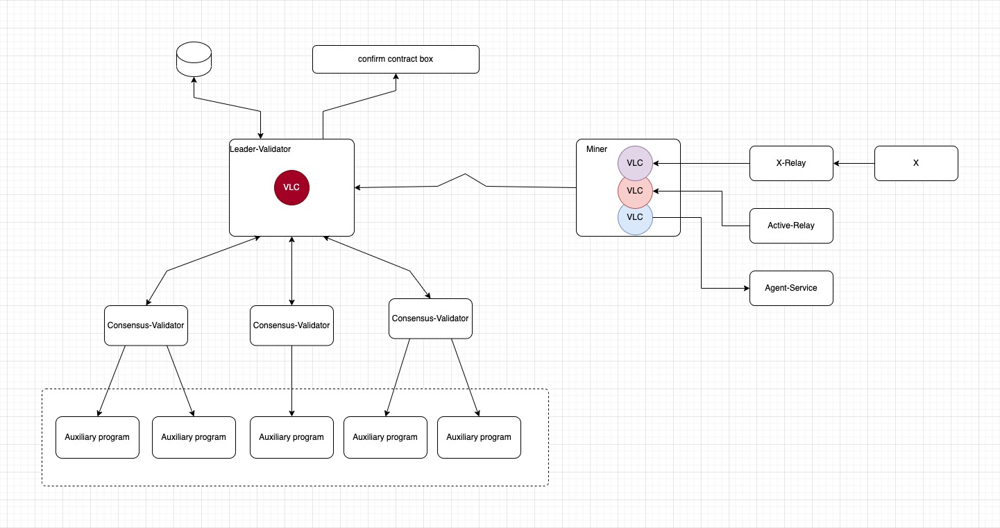

# V1 Overview

## System Architecture

The Intelligence KEY Mining system is built on a decentralized architecture with clear role divisions and incentive mechanisms:

1. **Role Division**: Users, Miners, Validators, Creators
2. **Incentive Mechanism**: VLC (Verifiable Labor Clock) as a proof-of-work mechanism
3. **Layered Validation**: Two-tier validation structure with Leader validator + Regular validators
4. **Data Availability**: Ensuring data persistence through DA services
5. **On-Chain Anchoring**: Final data upload to L1 blockchain to ensure security

## Workflow Phases

### Phase 1: Service Request and Response

- **User Initiates Request**: Regular users send requests to the network
- **Miner Provides Service**: Miners receive requests and provide corresponding services
- **VLC Update**: After completing the service, miners increment their maintained VLC counter by 1

### Phase 2: Data Packaging and Submission

- **Trigger Condition Check**: Miners monitor their VLC, triggering the packaging process when growth reaches 10 clock numbers
- **Data Packaging**: Miners package incremental VLC data, including current incremental data and signature information from the previous packaging
- **Digital Signature**: Digital signature is applied to the packaged data, forming a complete submission package
- **Submit to Leader**: Miners send the signed data package to the Leader validator

### Phase 3: Validation and Scoring

- **Data Distribution**: Leader validator receives the data package and distributes it to all regular consensus validators
- **Quality Validation**: Each regular consensus validator uses their own quality validator to evaluate the data package
- **Miner Scoring**: Validators score the corresponding miners based on validation results
- **Result Aggregation**: All validators aggregate scoring results and send them back to the Leader validator

### Phase 4: Final Evaluation and Processing

- **Comprehensive Scoring**: Leader validator provides final scoring for miners based on their own validation algorithms and strategies, combined with aggregated scoring results
- **Behavior Detection**: Leader validator analyzes validator performance to detect any malicious behavior
- **Punishment Mechanism**: If malicious behavior is detected, corresponding slash penalties are executed
- **VLC Update**: Leader validator updates their own maintained VLC

### Phase 5: Data Storage and On-Chain Recording

- **Cycle Check**: Monitor epoch cycles, triggering data upload process when the cycle ends
- **DA Service Upload**: Leader validator packages incremental VLC data from the epoch period and uploads it to DA (Data Availability) service
- **Receipt Confirmation**: DA service returns confirmation receipt to Leader validator after processing completion
- **L1 Blockchain Recording**: Leader validator finally submits the DA service receipt information to L1 blockchain, completing data confirmation and permanent storage for the entire cycle
