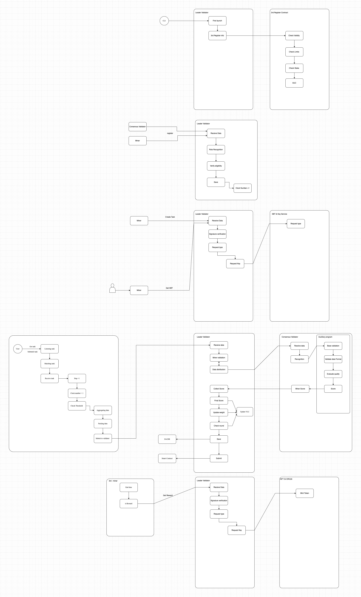

# V1 Validator

## Overview

The Leader Validator packages incremental VLC data at the end of each Epoch cycle and submits this data package to third-party DA (Data Availability) services or directly to the blockchain. This processing approach is similar to L2 solutions.

The Hetu SDK provides basic functionality, while project parties implement their own validation logic, such as the current agent service implementation.

## Component Functions

### Leader Validator Main Functions

#### Data Processing
1. **Receive Data**: Accept data packages submitted by Miners
2. **Check Validity**: Verify the format and signature validity of data packages
3. **Distribution**: Distribute data packages to all regular consensus validators

#### Scoring and Evaluation
1. **Collect Results**: Gather scoring results from all regular validators
2. **Weight Calculation**: Calculate weights based on validators' historical performance
3. **Final Score**: Generate the final comprehensive score for Miners

#### Security and Punishment
1. **Behavioral Analysis**: Analyze behavior patterns of Miners and Validators
2. **Malicious Detection**: Determine if malicious behavior exists based on preset rules
3. **Slash Execution**: Execute corresponding slash penalties against malicious actors

## Consensus Validator

In the Consensus Validator component, project parties define relevant business logic according to their own requirements.